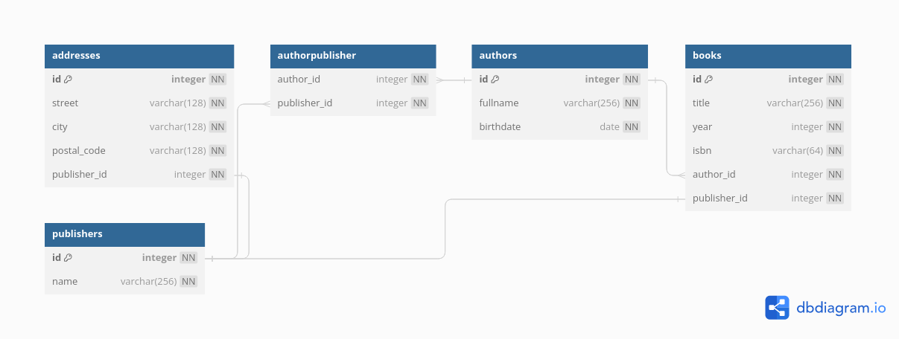

# Books

This is a learning project in which I broaden my knowledge in various topics such as:
- Working with databases and utilizing ORMs to integrate them neatly into a web application.
- Building web applications with the Flask framework with an emphasis on data handling and building APIs
- Cherry on top: HTMX for fast implementation of useful frontend features.

## What can you do with this app?

This is a webpage that allows the user to search for books by, e.g. title and name of the author. For each book, the user can access additional ressources. For example, what other books have been authored by this author?

## Entity Relationship Diagram - how is the data stored?


## Current design issues:
- [ ] The database model doesn't establish a relationship between books and publishers. Goal:



## Planned features:
- [x] Improve search functionality and performance on landing page.
- [ ] Add filter options for search:
    - precision of search (perfect match vs loose match)
- [x] Redirects to pages with details about a specific book or author.
- [ ] Filling the database with more real data (in development a database with 10 000 records of dummy data is in use, the live demo currently has 1000 records).
- [x] Adding APIs making the data more accessible.
- [ ] Improving Docker Compose: make the database persitent and make nginx and the flask app share a volume to facilitate nginx serving static files directly instead of going over the application.
- [ ] Improve look up time for the search function. Possibly index queried columns and/or adjust the search pattern.

Checked off features already made it into the application.

## Possible features:
- User login system to facilitate bookmarking certain books, or follow authors.
- Try out Docker compose with one nginx instance not only serving as a reverse proxy, but also as a load balancer forwarding requests to multiple instances of the Flask application in the same Docker network.

## Maybe features:
- Build a flask extension that eases prepopulating a database with real or fake data. It should also allow for an easy database teardown (deleting all records across tables). [Update: 29.01.2024] So far I created a custom flask command called *flask seeding* to make it easier for this project.

## APIs

- There are two different APIs. One can be found under */api*:
    - /authors -> list all authors
    - /books -> list all books
    - /publishers -> list all publishers 
    - /addresses -> list all addresses 
    - /authors/<int:id> -> grab author by id
    - /books/<int:id> -> grab book by id

- A new version can be found under */apis* and it includes documentation (swagger).


## Local Set Up - installing dependencies + run manually

Clone the repository and cd into the newly created directory. 

```
cd ./books/
```

Create a virtual environment, activate it an install the requirements:

```
python -m venv .venv
source ./.venv/bin/activate
pip install -r ./src/books/requirements.txt
```

Out of the box, this application runs off of an on-disk SQLite database. To use another database, do the following: create a file called *database.env* inside of the *instance* folder and include a line setting *PRODUCTION_DATABASE". The *instance* is created whenever the first *flask* command is called. Alternatively, just create it to make sure you use your database and proceed with the next steps afterwards:

```
mkdir instance
echo PRODUCTION_DATABASE=sqlite:///example.db > ./instance/database.env
```

The example above sets the production database key to use a SQLite database. You can use any other relational database that is supported by SQLAlchemy.

**IMPORTANT**: the database does not run on an SQLite databases. If you want to test the application locally, I recommend using a docker compose set-up or set the *PRODUCTION_DATABASE* environmental variable to point to a PostgreSQL database you have access to.

After that, create the database tables with this command:

```
flask db upgrade
```

Note: in case of SQLite, this command also creates the database file before creating the tables. Conveniently, the created SQLite database is stored in the same *instance* folder and as such excluded from version control.

Prepolutating the database with dummy data using the following command:

```
flask seeding <int:number>
```

Here, *number* is the number of records you want to create across each table in the database. After that you can run the application using the following command:

```
flask run
```

## Local Set Up - run using Docker compose

In the deployment subdirectory you find deployment configurations for the application. Either using a nginx reverse proxy, or plainly exposing port 5000 of the gunicorn server. For testing I reccomend the latter option as it only requires you to create a *.env* file in the same folder as the *docker-compose.yaml* file resides in setting environmental variables for the application database. The deployment version with nginx as reverse proxy requires pointing nginx to valid SSL certificates. You could of course, run this modifying the nginx configuration such that it does not require that.
